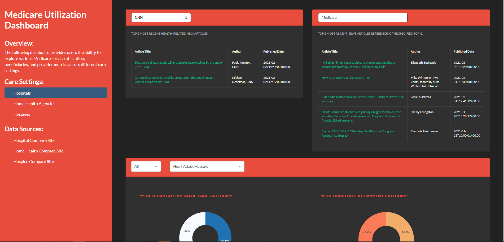
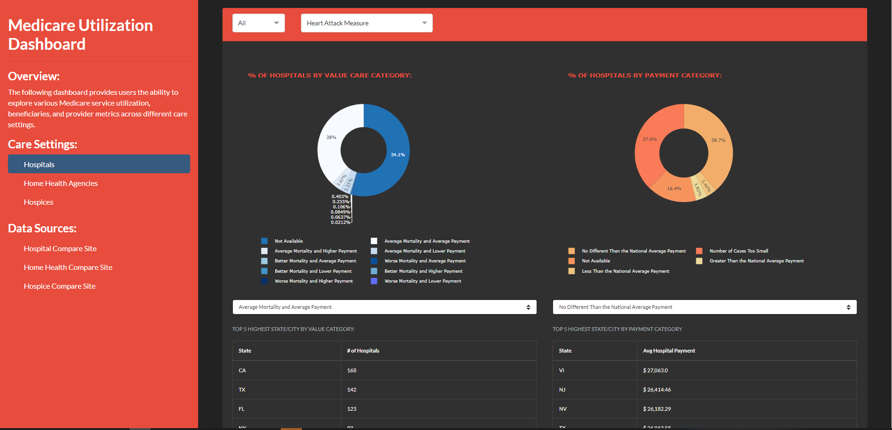
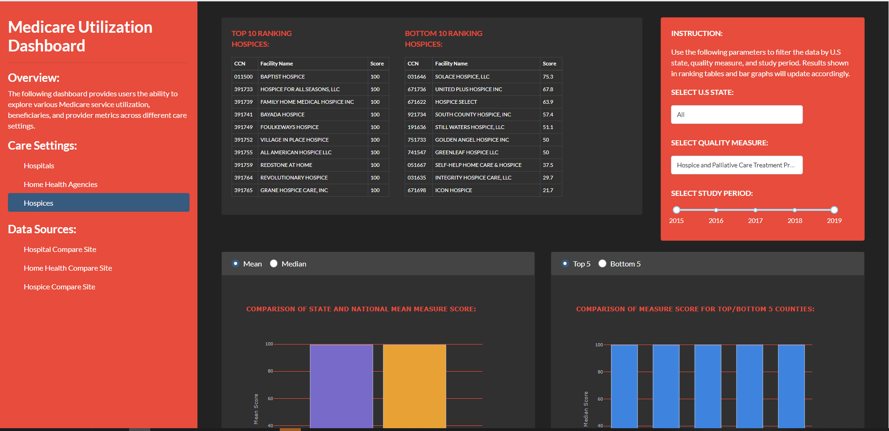
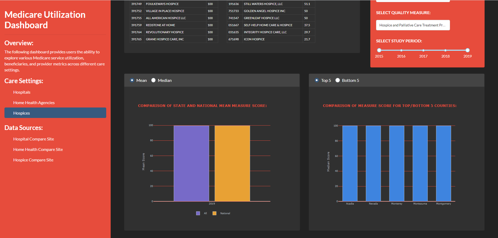
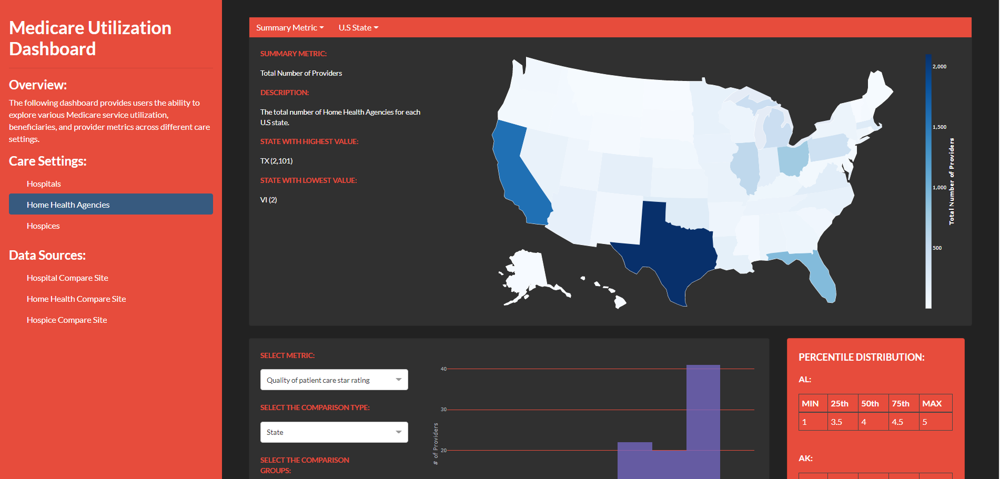
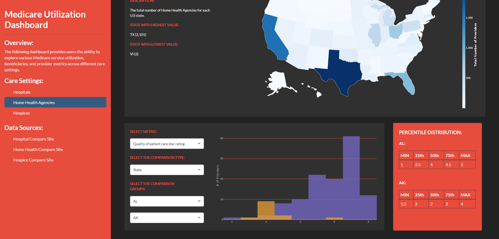

# Medicare-Utilization-Dashboard

# Project Overview: 
The following dashboard showcases Medicare utilization for different care settings, specifically, the inpatient hospital, hospice, and home health settings.
Features available on the dashboard include, but are not limited to:
- Comparing utilization across different U.S states and cities
- Obtaining the top or bottom ranking facilities based on utilization
- Searching for the latest news articles regarding a specified healthcare related topic
- Calculating the mean, median, and distribution of Medicare utilization

# Data Sources: 
All data used to construct the dashboard are from the Center for Medicare and Medicaid Services (CMS) [Care Compare website](https://www.medicare.gov/care-compare/). Links to the actual data files can be found on the dashboard itself as well. In addition, copies of the input data files can be found in the "data" folder under the current github repository.

# Dashboard Examples: 
The following images attempts to give users a sense of the layout of the Medicare Utilization dashboard available in the medicare_dashboard.py file.

### <i>Hospital Content Page</i> 

### <i>Hospice Content Page</i> 

### <i>Home Health Content Page</i> 

